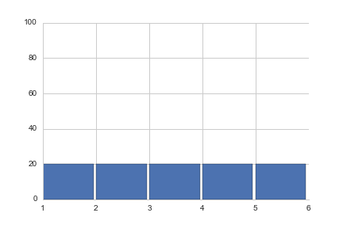
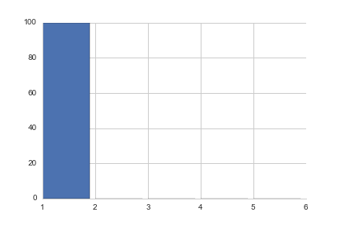

# What is Ouroboros ?

_Ouroboros_ is a function which measures the uniformity of a list of frequencies, independently of the size of the list.

  

__Input__:
* an array of frequencies (counts or proportions values) 

__Output__:
* Index: quantifies the uniformity of a list in an unitless scale (0 for min. uniformity, 1 for max. uniformity)
* Indice (option): the minimal number of groups that includes at least 50\% of the individuals (between 0 and N/2)

__Interpretation__:
* Index: twice the minimum percentage of values to include in order to reach 50% of individuals
* Index/2: the minimal proportion of groups which includes 50% of individuals

__Example__:

Individuals are evenly distributed among groups: Index = 1, Indice = 3

Individuals are distributed in 1 group: Index = 0, Indice=1

# How does Ouroboros work ?

A technical implementation of the function is provided in _ouroboros.py_.

__Pseudo-code (high-level)__:
- sort the list of frequencies in descending order
- accumulate values from the head until 50% individuals are included
- smooth values depending on the final percentage of individuals accumulated
- return the Index (and optionally the Indice) of the list

# Why is Ouroboros different ?

__Compared to the [median](https://en.wikipedia.org/wiki/Median)__, _Ouroboros_
does not cut a list of values in two lists of equal sizes. Instead, the function
finds the minimal number of values to sum in order to reach 50% of the distribution. 

__Compared to a
[Pearson's chi-squared test](https://en.wikipedia.org/wiki/Pearson%27s_chi-squared_test#Discrete_uniform_distribution)__,
_Ouroboros_ is not a statistic test value. Thus, _Ouroboros_ is simpler to compute and to interpret.

__Compared to
[Diversity indexes](https://en.wikipedia.org/wiki/Diversity_index)__, _Ouroboros_
returns percentage values instead of squared values (Gini-Simpson index) or
logarithmic values (Shannon index). This choice makes the function easier to
interpret since the scale is linear. In addition,
_Ouroboros_ will always returns an index of 0 or 1 for the two most extremes cases.

ARRAY           | OURO | GINI
----------------|------|-----
100             | 1.00 | 0.00
100,0           | 0.00 | 0.00
75,25           | 0.50 | 0.38
60,40           | 0.80 | 0.48
50,50           | 1.00 | 0.50
100,0,0         | 0.00 | 0.00
90,5,5          | 0.15 | 0.19
67,23,10        | 0.49 | 0.49
65,35,0         | 0.52 | 0.45
50,30,20        | 0.75 | 0.62
34,33,33        | 0.99 | 0.67
100,0,0,0       | 0.00 | 0.00
80,20,0,0       | 0.20 | 0.32
60,20,10,10     | 0.40 | 0.58
40,40,10,10     | 0.70 | 0.66
49,49,1,1       | 0.52 | 0.52
30,30,20,20     | 0.90 | 0.74
25,25,25,25     | 1.00 | 0.75
100,0,0,0,0     | 0.00 | 0.00
80,20,0,0,0     | 0.17 | 0.32
50,30,10,10,0   | 0.42 | 0.64
30,25,20,20,5   | 0.71 | 0.77
25,25,25,15,10  | 0.75 | 0.78
25,20,20,20,15  | 0.96 | 0.79
20,20,20,20,20  | 1.00 | 0.80

# FAQ

### Why the name of the function is Ouroboros ?

Heads and tails of statistic distributions are characteristic elements that can be used to measure equalities.

_Ouroboros_ is the "tail-devouring snake", which describes where "the head bites the tail of a distribution".
